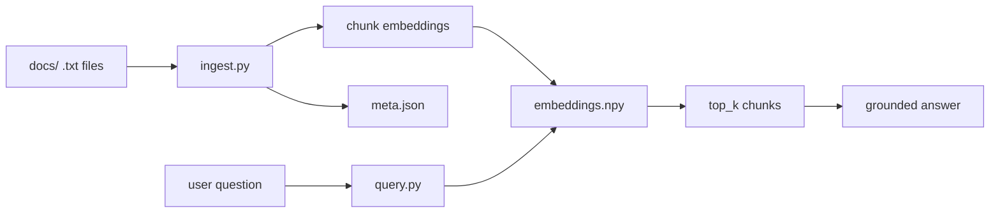

# Local RAG (Mini)

A minimal **Retrieval-Augmented Generation (RAG)** pipeline that runs entirely on your machine. Load `.txt` documents, chunk them, build a PyTorch-backed vector index with sentence-transformers, then ask questions and get **top-k retrieved chunks** (with source filenames) plus a **short, grounded answer**—no cloud APIs, no LLM calls, no hallucination.

Runs on **CPU** by default; uses **GPU** if available. Python 3.9+.

---

## Overview

This project implements a small RAG workflow:

1. **Ingest** — Read `.txt` files from a `docs/` folder, split them into overlapping chunks, compute embeddings with a local sentence-transformers model, and save the embedding matrix and metadata.
2. **Query** — For a user question, embed it, retrieve the top-k most similar chunks (L2 distance), and produce a short answer by selecting sentences only from those chunks.

Answers are **grounded**: they are built strictly from retrieved text, so the system does not invent facts. No external LLM or API is used.

---

## Architecture

End-to-end flow (as per the project plan):



**Ingest pipeline**

- **docs/** → discover all `.txt` files (recursive).
- **ingest.py** → chunk text (sliding window: `chunk_size`, `chunk_overlap`), load `all-MiniLM-L6-v2`, encode chunks to vectors, save:
  - `data/embeddings.npy` — NumPy array of shape `(n_chunks, embedding_dim)`.
  - `data/meta.json` — chunk texts, source filenames, model name, chunking params.

**Query pipeline**

- **query.py** (or **app.py** Streamlit UI) → load `embeddings.npy` and `meta.json`, load same embedding model, encode question, compute L2 distances to all chunks, take top-k, then build a short answer from those chunks only (sentence selection, no generation).

---

## Tech stack

| Component        | Choice |
|-----------------|--------|
| Embeddings      | `sentence-transformers` — model `all-MiniLM-L6-v2` (CPU-friendly, good quality) |
| Vector index    | PyTorch tensors + NumPy storage (`embeddings.npy`); retrieval via L2 distance |
| Answer building | Rule-based: concatenate top chunks, split sentences, pick sentences that match question keywords; no LLM |
| UI (optional)   | Streamlit (`app.py`) |

Dependencies: **PyTorch**, **sentence-transformers**, **Streamlit**, **tqdm**. No TensorFlow/Keras; the project uses a small stub so `transformers` never loads TF.

---

## Project structure

```
.
├── docs/                 # Your .txt documents (sample files included)
│   ├── project_overview.txt
│   ├── how_to_use.txt
│   └── faq.txt
├── data/                 # Generated by ingest (do not commit embeddings.npy)
│   ├── embeddings.npy    # Chunk embedding matrix
│   └── meta.json         # Chunk texts, sources, config
├── ingest.py             # Build index from docs/
├── query.py              # CLI: retrieve + grounded answer
├── app.py                # Streamlit UI
├── requirements.txt
└── README.md
```

---

## Prerequisites

- **Python** 3.9 or newer  
- (Optional) **CUDA** for GPU-accelerated embeddings

---

## Installation

1. **Clone the repository**

   ```bash
   git clone https://github.com/padmanabh275/local-rag-mini.git
   cd local-rag-mini
   ```

2. **Create and activate a virtual environment**

   ```bash
   python -m venv venv
   # Windows
   venv\Scripts\activate
   # macOS / Linux
   source venv/bin/activate
   ```

3. **Install dependencies**

   ```bash
   pip install -r requirements.txt
   ```

   The project uses only PyTorch (no TensorFlow/Keras).

---

## Usage

### 1. Add documents

Put your `.txt` files in `docs/`. The repo includes sample files: `project_overview.txt`, `how_to_use.txt`, `faq.txt`. Any `.txt` under `docs/` (including in subfolders) is picked up.

### 2. Build the index

```bash
python ingest.py
```

Defaults: `--docs_dir docs`, `--output_dir data`, `--chunk_size 500`, `--chunk_overlap 100`. Override as needed:

```bash
python ingest.py --docs_dir docs --output_dir data --chunk_size 500 --chunk_overlap 100
```

Optional: `--device cpu` to force CPU; omit to auto-detect (GPU if available).

This creates `data/embeddings.npy` and `data/meta.json`.

### 3. Query (CLI)

```bash
python query.py --question "How do I build the index?"
```

Interactive (prompt for question):

```bash
python query.py
```

Retrieve more than 3 chunks:

```bash
python query.py --question "Your question" --k 5
```

### 4. Query (Streamlit UI)

```bash
streamlit run app.py
```

Use the text input for your question and the slider to choose how many chunks to retrieve (default 3). Results show source filename and snippet per chunk, plus the grounded answer.

---

## Example output

**Question:** `How do I build the index?`

**Top 3 retrieved chunks:**

- **[1]** Source: `how_to_use.txt`  
  Step 3: Build the index. Run ingest.py with default folders (docs/ and data/): `python ingest.py`. Or specify paths: `python ingest.py --docs_dir docs --output_dir data --chunk_size 500 --chunk_overlap 100`.

- **[2]** Source: `how_to_use.txt`  
  Step 2: Add your documents. Place any .txt files you want to search in the docs/ folder. The ingest script will find all files ending in .txt recursively.

- **[3]** Source: `faq.txt`  
  Q: Where is the index stored? A: By default in the data/ folder: embeddings.npy (embedding matrix) and meta.json (chunk texts and source filenames).

**Answer:**

Based on the documents, run ingest.py with default folders (docs/ and data/): `python ingest.py`. Or specify paths: `python ingest.py --docs_dir docs --output_dir data --chunk_size 500 --chunk_overlap 100`. The index is stored by default in the data/ folder: embeddings.npy (embedding matrix) and meta.json (chunk texts and source filenames).

---

Answers are **grounded**: built only from the retrieved chunks. No external LLM is used.

---

## CLI reference

| Script       | Option          | Default   | Description |
|-------------|-----------------|-----------|-------------|
| `ingest.py` | `--docs_dir`    | `docs`    | Folder containing .txt files |
| `ingest.py` | `--output_dir`  | `data`    | Folder for embeddings.npy and meta.json |
| `ingest.py` | `--chunk_size`  | `500`     | Characters per chunk |
| `ingest.py` | `--chunk_overlap` | `100`   | Overlap between chunks |
| `ingest.py` | `--device`      | auto      | `cpu` or `cuda` |
| `query.py`  | `--question` / `-q` | (prompt) | Question string |
| `query.py`  | `--k`           | `3`       | Number of chunks to retrieve |
| `query.py`  | `--data_dir`    | `data`    | Folder with embeddings.npy and meta.json |

---

## Files reference

| Path               | Purpose |
|--------------------|--------|
| `docs/`            | Input .txt documents (sample files included). |
| `data/embeddings.npy` | Generated embedding matrix (do not commit if large). |
| `data/meta.json`   | Generated chunk metadata and config. |
| `ingest.py`        | Build index from docs/. |
| `query.py`         | CLI: retrieve top-k chunks and print grounded answer. |
| `app.py`           | Streamlit app: question input, top chunks + answer. |
| `requirements.txt` | Python dependencies. |

---

## License

MIT (or your choice). See repository for details.
